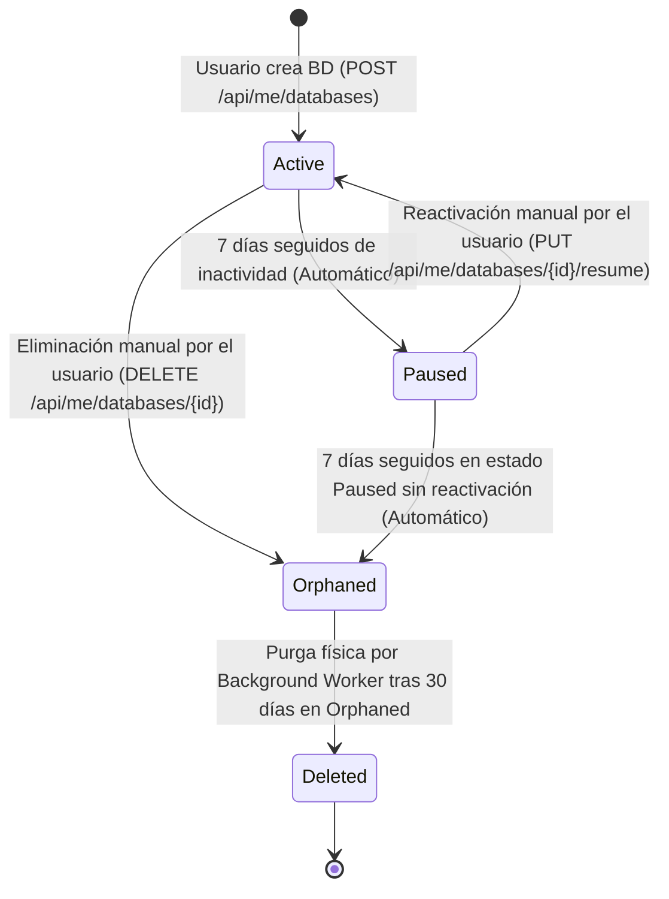

leaeaclc

# Lógica Definitiva del Ciclo de Vida de Bases de Datos (Raft-DB Platform)

## 📌 1. Visión General de la Estrategia

Para garantizar la integridad de los datos, la experiencia de usuario (UX) y el uso óptimo de recursos en el servidor de Microsoft SQL Server (y motores adjuntos), la plataforma implementa una estrategia de **Soft-Delete con Marcado de Orfandad, Revocación de Permisos y Borrado Físico Diferido**.

### Principios Fundamentales:

- **Protección contra Eliminación Accidental:** El usuario **nunca** destruye la base de datos de manera física e inmediata al hacer clic en "Eliminar".
- **Liberación Inmediata de Cuota:** Tan pronto como una base de datos pasa al estado `Orphaned` (Huérfana), **deja de contar** para el límite de bases de datos del estudiante. El usuario puede crear una nueva instancia inmediatamente.
- **Aislamiento de Seguridad:** Al pasar al estado `Orphaned`, se le aplican denegaciones explícitas de conexión (`DENY CONNECT TO`), impidiendo que el usuario pueda acceder o alterar los datos.
- **Periodo de Retención (30 días):** Toda base de datos huérfana se conserva intacta en disco durante 30 días antes de ser eliminada físicamente de forma automática.

---

## 🏛️ 2. Máquina de Estados del Ciclo de Vida



### Tabla Resumen de Estados

| Estado                 | Acceso Usuario                  | Cuota Consumida         | Descripción                                                                   | Transición Siguiente                                                                             |
| ---------------------- | ------------------------------- | ----------------------- | ------------------------------------------------------------------------------ | ------------------------------------------------------------------------------------------------- |
| **`Active`**   | Sí (Lectura/Escritura)         | **Sí**           | Base de datos operativa y activa.                                              | Pasa a`Paused` si está 7 días inactiva, o a `Orphaned` si el usuario la elimina.            |
| **`Paused`**   | No (Conexión suspendida)       | **Sí**           | Pausada para liberar RAM/CPU. El usuario puede reactivarla.                    | Pasa a`Active` si el usuario la reactiva, o a `Orphaned` tras 7 días en pausa sin reactivar. |
| **`Orphaned`** | **No** (`DENY CONNECT`) | **NO** (Liberada) | Marcatura de orfandad/borrado lógico. Permisos revocados.                     | Pasa a`Deleted` (Purga física) tras 30 días.                                                  |
| **`Deleted`**  | No                              | NO                      | Purga física ejecutada (`DROP DATABASE`). Registros históricos archivados. | Estado final.                                                                                     |

---

## ⏰ 3. Tiempos y Reglas de Transición

1. **Inactividad a Pausa (`Active` → `Paused`):**

   - **Regla:** Si una BD activa no presenta conexiones ni actividad en los últimos **7 días**.
   - **Acción:** Transición a `Status = 'Paused'` y denegación de conexión.
   - **Recuperación:** El estudiante entra al Dashboard y presiona "Reactivar".
2. **Abandono a Orfandad (`Paused` → `Orphaned`):**

   - **Regla:** Si una BD permanece en estado `Paused` durante **7 días** sin ser reactivada por el usuario (total acumulado de inactividad: 14 días).
   - **Acción:** Transición a `Status = 'Orphaned'`, asignación de `Deleted_at = UTC_NOW`.
   - **Efecto:** La cuota del usuario queda totalmente libre.
3. **Eliminación Voluntaria (`Active` / `Paused` → `Orphaned`):**

   - **Regla:** Petición HTTP `DELETE /api/me/databases/{id}` enviada por el estudiante.
   - **Acción:** Transición directa a `Status = 'Orphaned'`, revocación de permisos (`DENY CONNECT`).
   - **Efecto:** La cuota del usuario se libera al instante, permitiéndole crear una nueva BD en ese momento. **No se ejecuta `DROP DATABASE`**.
4. **Purga Física Definitiva (`Orphaned` → `Deleted`):**

   - **Regla:** Base de datos en estado `Orphaned` con más de **30 días** en dicho estado.
   - **Acción:** El worker en segundo plano ejecuta `ALTER DATABASE [...] SET SINGLE_USER WITH ROLLBACK IMMEDIATE; DROP DATABASE [...]` y limpia logins si aplica.

---

## 🗄️ 4. Script Compatible con DBeaver (`EXEC (...)`)

Para ejecutar este script en **DBeaver** de una sola vez sin errores de "lotes de consulta" (Batch Boundaries), envolvemos cada sentencia DDL en `EXEC (...)`:

```sql
USE [RaftDb];
GO

-- 1. Actualizar procedimiento de consulta de estado de aprovisionamiento (Liberación de Cuota)
EXEC('
CREATE OR ALTER PROCEDURE usp_Users_GetSharedSqlServerProvisioningState
    @UserId INT,
    @Engine NVARCHAR(50) = NULL
AS
BEGIN
    SET NOCOUNT ON;

    SELECT
        SharedLoginName = CONCAT(''raft_u'', @UserId),
        HasExistingDatabases = CASE WHEN EXISTS (
            SELECT 1
            FROM DatabaseInstances di
            WHERE di.UserId = @UserId
              AND (@Engine IS NULL OR di.Engine = @Engine)
              AND di.Deleted_at IS NULL
              AND di.Status NOT IN (''Orphaned'', ''Deleted'')
        ) THEN CAST(1 AS BIT) ELSE CAST(0 AS BIT) END,
        EncryptedPassword = (
            SELECT TOP 1 ac.EncryptedPassword
            FROM AccessCredentials ac
            INNER JOIN DatabaseInstances di ON di.Id = ac.DatabaseInstanceId
            WHERE di.UserId = @UserId
              AND (@Engine IS NULL OR di.Engine = @Engine)
              AND di.Deleted_at IS NULL
              AND di.Status NOT IN (''Orphaned'', ''Deleted'')
              AND ac.Deleted_at IS NULL
            ORDER BY di.Id
        );
END;
');

-- 2. Actualizar Vista del Dashboard del Usuario (Muestra Active, Paused y Suspended)
EXEC('
CREATE OR ALTER VIEW vw_UserDashboard
AS
SELECT
    di.Id AS DatabaseInstanceId,
    di.UserId,
    di.Host,
    di.Port,
    di.DatabaseName,
    di.DatabaseUser,
    di.Engine,
    di.Status,
    di.UsedSpaceBytes,
    di.MaxSpaceBytes,
    di.LastActivity,
    di.Created_at AS CreatedAt
FROM DatabaseInstances di
WHERE di.Deleted_at IS NULL
  AND di.Status NOT IN (''Orphaned'', ''Deleted'');
');

-- 3. Procedimiento para orfanar base de datos (Soft Delete por Usuario o por Sistema)
EXEC('
CREATE OR ALTER PROCEDURE usp_DatabaseInstances_SoftDelete
    @Id INT
AS
BEGIN
    SET NOCOUNT ON;

    UPDATE DatabaseInstances
    SET Deleted_at = SYSUTCDATETIME(),
        Status = ''Orphaned'',
        Updated_at = SYSUTCDATETIME()
    WHERE Id = @Id AND Deleted_at IS NULL;

    UPDATE AccessCredentials
    SET Deleted_at = SYSUTCDATETIME(),
        Updated_at = SYSUTCDATETIME()
    WHERE DatabaseInstanceId = @Id AND Deleted_at IS NULL;
END;
');

-- 4. Obtener bases de datos activas inactivas por 7 días (Elegibles para Pausa)
EXEC('
CREATE OR ALTER PROCEDURE usp_DatabaseInstances_GetDueForPause
    @InactivityDays INT = 7
AS
BEGIN
    SET NOCOUNT ON;

    SELECT Id
    FROM DatabaseInstances
    WHERE Deleted_at IS NULL
      AND Status = ''Active''
      AND COALESCE(LastActivity, Created_at) <= DATEADD(DAY, -@InactivityDays, SYSUTCDATETIME());
END;
');

-- 5. Obtener bases de datos pausadas sin reactivar por 7 días (Elegibles para Orfandad)
EXEC('
CREATE OR ALTER PROCEDURE usp_DatabaseInstances_GetDueForOrphan
    @InactivityDays INT = 7
AS
BEGIN
    SET NOCOUNT ON;

    SELECT Id
    FROM DatabaseInstances
    WHERE Deleted_at IS NULL
      AND Status = ''Paused''
      AND COALESCE(Updated_at, Created_at) <= DATEADD(DAY, -@InactivityDays, SYSUTCDATETIME());
END;
');

-- 6. Obtener bases de datos huérfanas con más de 30 días (Elegibles para Purga Física)
EXEC('
CREATE OR ALTER PROCEDURE usp_DatabaseInstances_GetDueForDelete
    @InactivityDays INT = 30
AS
BEGIN
    SET NOCOUNT ON;

    SELECT Id
    FROM DatabaseInstances
    WHERE Status = ''Orphaned''
      AND COALESCE(Deleted_at, Updated_at, Created_at) <= DATEADD(DAY, -@InactivityDays, SYSUTCDATETIME());
END;
');
```
