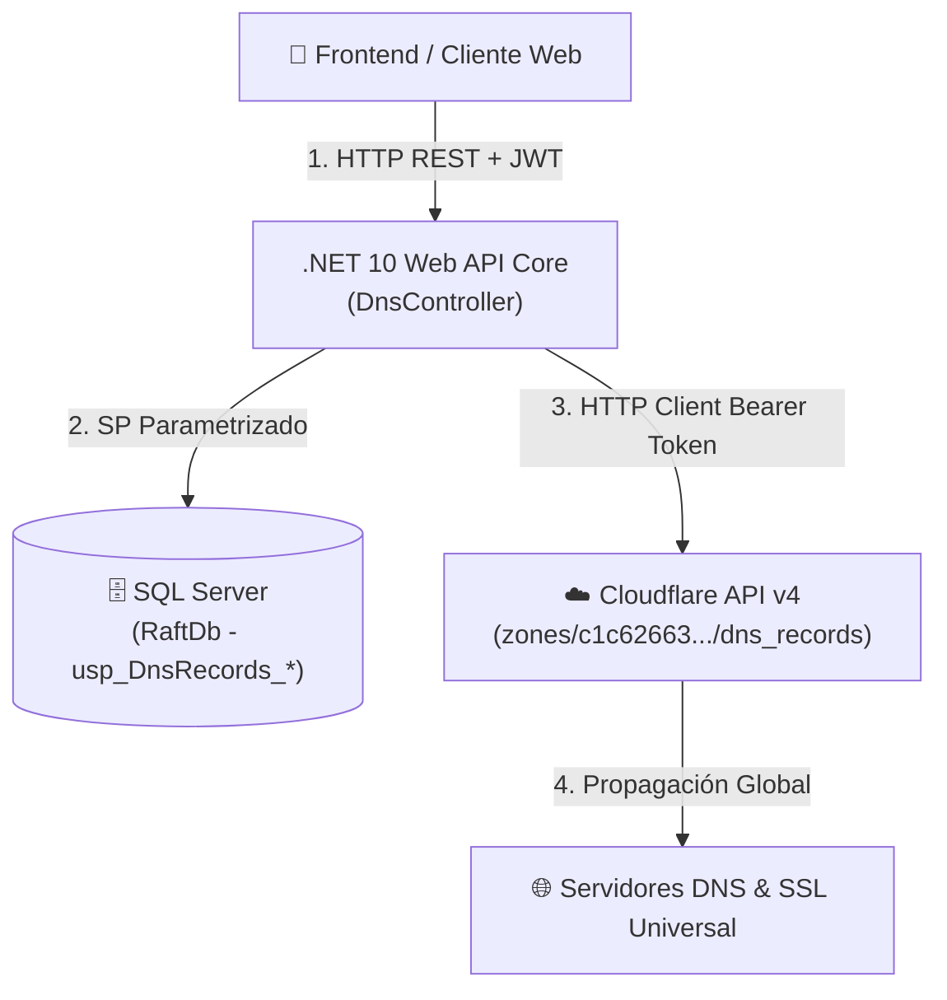
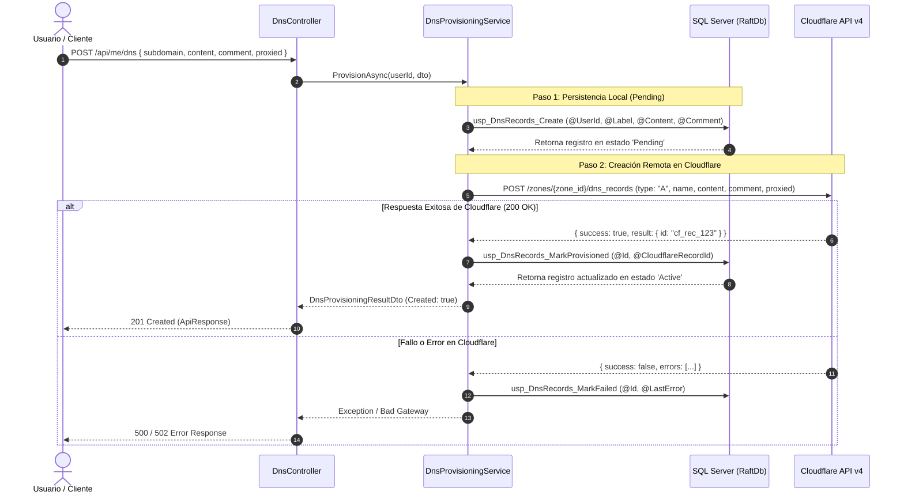
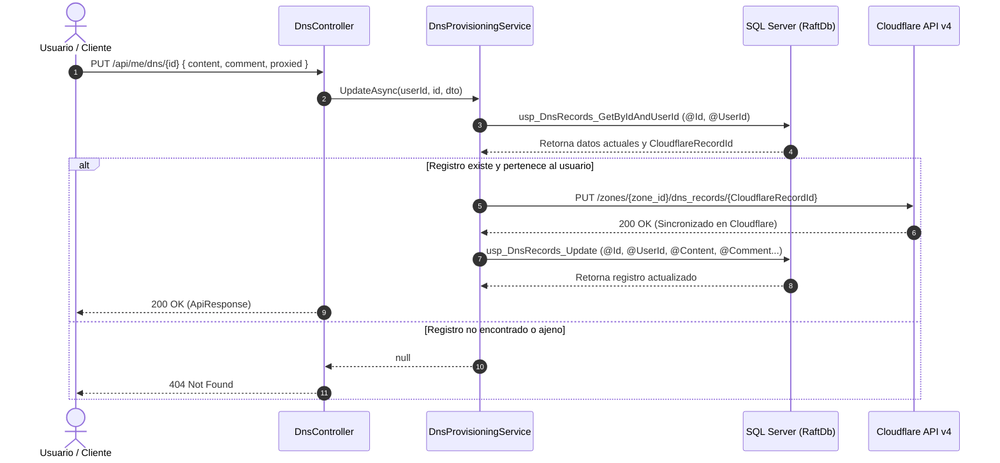
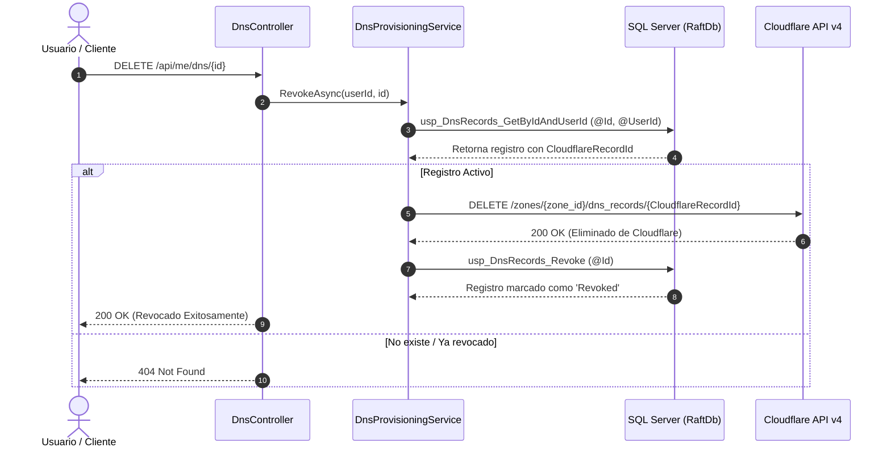
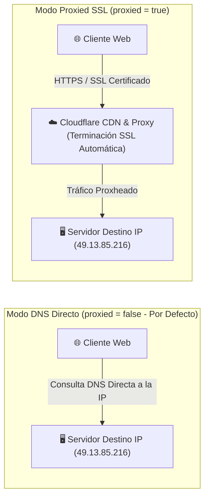

# Documentación del Servicio de DNS y SSL (Cloudflare & Raft-DB)

Esta documentación describe la arquitectura, flujos de trabajo, esquemas de base de datos y guía de integración frontend para la célula de aprovisionamiento de **Registros DNS (Tipo A)** y **Certificados SSL** en la plataforma Raft-DB.

---

## 🏛️ 1. Arquitectura del Servicio

El servicio sigue estrictamente la filosofía **Database-Centric** de la plataforma:
- **Base de Datos (SQL Server):** Ejecuta la lógica de persistencia, estados y consultas de metadata mediante Stored Procedures parametrizados (`usp_DnsRecords_*`).
- **Backend (.NET 10 Web API):** Actúa como middleware de transporte e integración. Valida peticiones HTTP autenticadas con JWT, invoca Stored Procedures en SQL Server y se comunica mediante HTTP/REST con la API v4 de Cloudflare.
- **Cloudflare API v4:** Administra en tiempo real los registros DNS en el dominio `coderhivex.com` y provee terminación automática de certificados SSL/TLS (Universal SSL).



---

## 📊 2. Flujos de Trabajo (Diagramas de Secuencia)

### 2.1. Creación (Aprovisionamiento de Subdominio)



**Explicación del flujo de creación:**
1. El usuario envía el subdominio deseado (ej: `testdb`), la dirección IP destino (ej: `49.13.85.216`), un comentario opcional y la opción `proxied` (`false` por defecto).
2. Se registra primero en la base de datos SQL Server en estado `Pending` para garantizar trazabilidad.
3. Se invoca la API v4 de Cloudflare para crear el registro tipo A en `coderhivex.com`.
4. Si Cloudflare confirma la creación, se invoca `usp_DnsRecords_MarkProvisioned` y el estado pasa a `Active`.
5. Si Cloudflare rechaza la petición, se invoca `usp_DnsRecords_MarkFailed` registrando el mensaje de error exacto.

---

### 2.2. Edición (Actualización de Subdominio, IP o Comentario)



**Explicación del flujo de edición:**
1. El servicio verifica previamente que el registro exista en SQL Server y pertenezca al usuario autenticado.
2. Realiza un llamado `PUT` a Cloudflare API actualizando los datos en tiempo real.
3. Actualiza los valores en la base de datos SQL Server mediante el Stored Procedure `usp_DnsRecords_Update`.

---

### 2.3. Eliminación (Revocación de Subdominio)



**Explicación del flujo de eliminación:**
1. Se elimina el registro remoto directamente en Cloudflare para liberar la zona DNS.
2. Se realiza una eliminación lógica en SQL Server marcando el estado como `Revoked` y registrando `RevokedAt`.

---

### 2.4. Modo Proxy vs DNS Directo



- **`proxied: false` (Por Defecto):** Tráfico directo por resolución DNS normal hacia la IP configurada.
- **`proxied: true` (Opcional):** El tráfico pasa por el CDN/Proxy de Cloudflare, habilitando protección contra DDoS y **certificados SSL automáticos**.

---

## 🗄️ 3. Estructura de la Base de Datos (SQL Server)

Script de creación: `Database/Scripts/init-dns-tables-and-sps.sql`.

### Tabla `dbo.DnsRecords`
| Columna | Tipo de Dato | Descripción |
| :--- | :--- | :--- |
| `Id` | `INT IDENTITY` | Identificador único local |
| `UserId` | `INT` | Clave foránea del usuario propietario (`Users.Id`) |
| `Label` | `NVARCHAR(100)` | Etiqueta del subdominio (ej: `testdb`) |
| `RecordName` | `NVARCHAR(200)` | Nombre completo del registro |
| `Fqdn` | `NVARCHAR(255)` | FQDN completo (ej: `testdb.coderhivex.com`) |
| `RecordType` | `VARCHAR(10)` | Tipo de registro (por defecto `'A'`) |
| `Content` | `NVARCHAR(255)` | Dirección IP de destino (ej: `49.13.85.216`) |
| `Comment` | `NVARCHAR(500)` | Comentario u observación del usuario |
| `RecordTtl` | `INT` | TTL en segundos (`1` = Automático) |
| `Proxied` | `BIT` | Bandera de proxy Cloudflare (`0` = Desactivado, `1` = Activado) |
| `CloudflareZoneId` | `VARCHAR(100)` | ID de la zona en Cloudflare |
| `CloudflareRecordId` | `VARCHAR(100)` | ID del registro remoto en Cloudflare |
| `Status` | `VARCHAR(50)` | Estado (`Pending`, `Active`, `Failed`, `Revoked`) |
| `LastError` | `NVARCHAR(MAX)` | Detalle del último error (si aplica) |
| `CreatedAt` | `DATETIME2` | Fecha de creación |
| `UpdatedAt` | `DATETIME2` | Fecha de última actualización |
| `RevokedAt` | `DATETIME2` | Fecha de eliminación/revocación |

---

## 📱 4. Guía de Integración y Payloads JSON para el Frontend (Dart / Flutter)

### 4.1. Resumen de Endpoints API (`/api/me/dns`)

| Método | Endpoint | Descripción | Header Requerido |
| :--- | :--- | :--- | :---: |
| `GET` | `/api/me/dns` | Listar todos los subdominios del usuario | `Authorization: Bearer <JWT>` |
| `GET` | `/api/me/dns/{id}` | Obtener detalle de un subdominio por ID | `Authorization: Bearer <JWT>` |
| `POST` | `/api/me/dns` | Crear un nuevo subdominio DNS | `Authorization: Bearer <JWT>` |
| `PUT` | `/api/me/dns/{id}` | Editar subdominio, IP, comentario o proxy | `Authorization: Bearer <JWT>` |
| `DELETE` | `/api/me/dns/{id}` | Eliminar subdominio | `Authorization: Bearer <JWT>` |

---

### 4.2. Payloads JSON de Entrada y Salida (Request / Response Contract)

#### **1. Crear Registro DNS (`POST /api/me/dns`)**

- **JSON Body que debe enviar el Frontend (Request):**
```json
{
  "subdomain": "testdb",
  "content": "49.13.85.216",
  "comment": "Mi base de datos principal",
  "proxied": false
}
```

- **JSON Body que responde el Backend (201 Created):**
```json
{
  "success": true,
  "message": "DNS record provisioned successfully.",
  "data": {
    "created": true,
    "record": {
      "id": 1,
      "userId": 5,
      "label": "testdb",
      "subdomain": "testdb",
      "recordName": "testdb",
      "fqdn": "testdb.coderhivex.com",
      "recordType": "A",
      "content": "49.13.85.216",
      "comment": "Mi base de datos principal",
      "recordTtl": 1,
      "proxied": false,
      "sslStatus": "DNS Only",
      "cloudflareZoneId": "c1c62663d28fa916dc9bc030103e6e83",
      "cloudflareRecordId": "9b12a84f3c7b...",
      "status": "Active",
      "lastError": null,
      "createdAt": "2026-08-06T11:00:00Z",
      "updatedAt": "2026-08-06T11:00:01Z",
      "revokedAt": null
    }
  }
}
```

---

#### **2. Listar Subdominios del Usuario (`GET /api/me/dns`)**

- **JSON Body que responde el Backend (200 OK):**
```json
{
  "success": true,
  "message": "DNS records retrieved successfully.",
  "data": [
    {
      "id": 1,
      "userId": 5,
      "label": "testdb",
      "subdomain": "testdb",
      "recordName": "testdb",
      "fqdn": "testdb.coderhivex.com",
      "recordType": "A",
      "content": "49.13.85.216",
      "comment": "Mi base de datos principal",
      "recordTtl": 1,
      "proxied": false,
      "sslStatus": "DNS Only",
      "cloudflareZoneId": "c1c62663d28fa916dc9bc030103e6e83",
      "cloudflareRecordId": "9b12a84f3c7b...",
      "status": "Active",
      "lastError": null,
      "createdAt": "2026-08-06T11:00:00Z",
      "updatedAt": "2026-08-06T11:00:01Z",
      "revokedAt": null
    }
  ]
}
```

---

#### **3. Editar Subdominio (`PUT /api/me/dns/{id}`)**

- **JSON Body que debe enviar el Frontend (Request):**
```json
{
  "content": "49.13.85.217",
  "comment": "IP de servidor secundario",
  "proxied": false
}
```

- **JSON Body que responde el Backend (200 OK):**
```json
{
  "success": true,
  "message": "DNS record updated successfully.",
  "data": {
    "id": 1,
    "userId": 5,
    "label": "testdb",
    "subdomain": "testdb",
    "recordName": "testdb",
    "fqdn": "testdb.coderhivex.com",
    "recordType": "A",
    "content": "49.13.85.217",
    "comment": "IP de servidor secundario",
    "recordTtl": 1,
    "proxied": false,
    "sslStatus": "DNS Only",
    "cloudflareZoneId": "c1c62663d28fa916dc9bc030103e6e83",
    "cloudflareRecordId": "9b12a84f3c7b...",
    "status": "Active",
    "lastError": null,
    "createdAt": "2026-08-06T11:00:00Z",
    "updatedAt": "2026-08-06T11:15:00Z",
    "revokedAt": null
  }
}
```

---

#### **4. Eliminar Subdominio (`DELETE /api/me/dns/{id}`)**

- **JSON Body que responde el Backend (200 OK):**
```json
{
  "success": true,
  "message": "DNS record revoked successfully.",
  "data": true
}
```

---

### 4.3. Recomendaciones de UI/UX para la vista Flutter / Frontend

1. **Formulario Modal de Creación / Edición:**
   - **Campo Subdominio (`subdomain`):** Campo de texto para ingresar el nombre del subdominio (ej: `testdb`). Mostrar abajo la vista previa en tiempo real del FQDN completo: `testdb.coderhivex.com`.
   - **Campo Dirección IP (`content`):** Campo de texto para la IP v4 destino.
   - **Campo Comentario (`comment`):** Campo de texto opcional para notas personales del usuario (ej: `"Servidor de desarrollo"`).
   - **Switch / Checkbox Proxy (`proxied`):** Desactivado por defecto (OFF). Incluir una aclaración visual: *"Desactivado: Conexión DNS directa. Activado: Habilita SSL y protección Cloudflare."*

2. **Tabla / Tarjetas de Listado:**
   - **Chips de Estado (`status`):**
     - `Active`: Verde 🟢
     - `Pending`: Amarillo 🟡
     - `Failed`: Rojo 🔴 (al pulsar/hover mostrar `lastError`)
   - **Badge SSL (`sslStatus`):**
     - `Active (Cloudflare SSL Proxied)`: Azul / Candado SSL 🔒
     - `DNS Only`: Gris / Red 🌐
   - **Acciones:** Botón **Editar** (abre el diálogo modal prellenado) y botón **Eliminar** (diálogo de confirmación).
