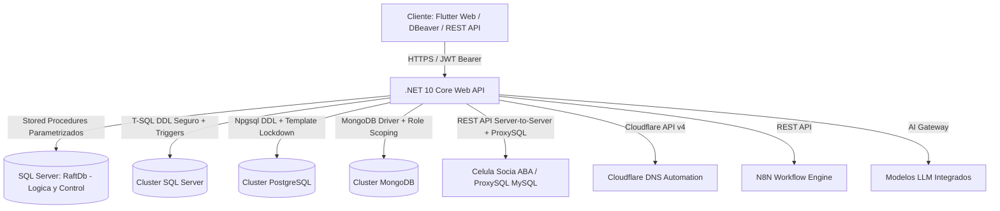
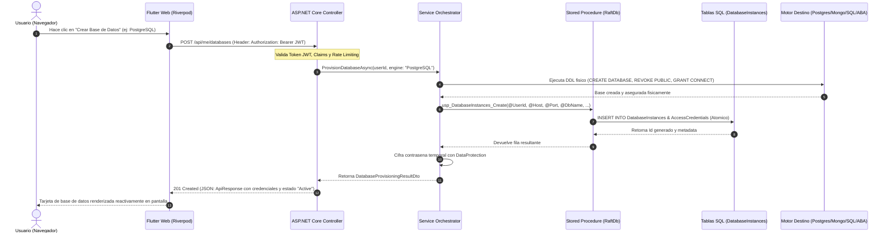
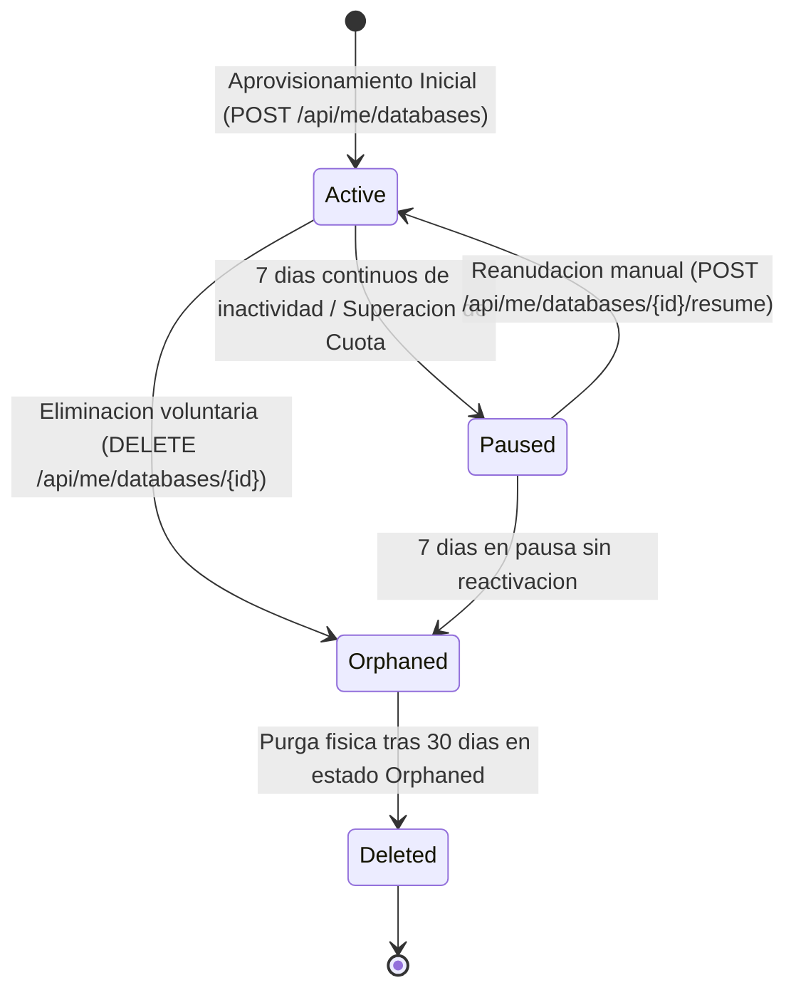

# Dossier Tecnico y Guia de Contexto: Raft Cloud (Raft)

## 1. Vision General, Historia y Origen del Proyecto

### 1.1 Nombre y Evolucion del Proyecto
El proyecto nacio originalmente bajo la denominacion de **Raft Consensus**, inspirado directamente en el algoritmo de consenso distribuido Raft y en el problema fundamental del **Teorema CAP (Triangulo de Objetivos: Consistencia, Disponibilidad y Tolerancia a Particiones)**. 

Asi como el algoritmo Raft resuelve la coordinacion y confiabilidad de nodos en entornos distribuidos sin la complejidad inmanejable de Paxos, esta plataforma fue concebida para resolver la orquestacion confiable, sincronizacion y aislamiento de servicios de bases de datos e infraestructura en un cluster heterogeneo de servidores. Con la maduracion del producto y la incorporacion de servicios complementarios (DNS automatizado, automatizacion de flujos con N8N y pasarela de Inteligencia Artificial), la plataforma evoluciono comercial y tecnicamente hacia su nombre definitivo: **Raft Cloud** (o simplemente **Raft**).

### 1.2 Declaracion del Problema y Oportunidad de Mercado
En el desarrollo de software y en entornos educativos / formativos, los desarrolladores enfrentan una friccion constante:
1. **Setup Hell Local:** La instalacion manual de multiples motores (SQL Server, PostgreSQL, MongoDB, MySQL) consume recursos excesivos de memoria RAM y CPU en maquinas locales y genera inconsistencias de versionamiento.
2. **Costos y Complejidad de la Nube Tradicional:** Proveedores como AWS, Azure o GCP exigen configuraciones de red complejas (VPCs, Security Groups, IAM Roles) y conllevan el riesgo de facturacion imprevista.
3. **Fugas de Recursos y Falta de Aislamiento en Servidores Compartidos:** Los entornos compartidos tradicionales suelen sufrir de bases de datos abandonadas ("zombies") que saturan el disco, y de problemas graves de seguridad donde los usuarios pueden listar o modificar las bases de datos de otros colegas.
4. **Vulnerabilidad DDL:** Otorgar permisos para que un estudiante cree tablas usualmente le permite ejecutar comandos destructivos como `DROP DATABASE`, poniendo en riesgo el cluster compartido.

### 1.3 La Propuesta de Valor de Raft Cloud
Raft Cloud es una plataforma de servicios en la nube para desarrolladores que ofrece:
- **Aprovisionamiento Instantaneo (Self-Service):** Creacion automatizada de instancias de bases de datos en menos de 3 segundos, entregando host, puerto, usuario y contrasena listos para conectar desde cualquier cliente (DBeaver, DataGrip, VS Code, APIs).
- **Aislamiento Multi-Tenant Real:** Cada usuario opera en un entorno hermetico donde solo puede ver y gestionar sus propios recursos.
- **Ciclo de Vida Inteligente con Retencion de 30 Dias:** Las bases de datos inactivas se pausan automaticamente para ahorrar recursos, y las eliminadas se preservan como huerfanas durante 30 dias antes de su purga definitiva, evitando perdida accidental de datos.
- **Ecosistema Integrado de Servicios:** Integracion nativa de zonas DNS Cloudflare, orquestacion de flujos con N8N y consumo de modelos de Inteligencia Artificial mediante API Keys unificadas.

---

## 2. Arquitectura del Sistema y Principios de Diseno

### 2.1 Filosofia Arquitectonica: Database-Centric
La arquitectura de Raft Cloud sigue el principio Database-Centric:
- **Backend (.NET 10 Web API):** Opera como una capa de transporte de alto rendimiento, gestionando enrutamiento HTTP, autenticacion JWT/OAuth, rate limiting y despacho de peticiones. No contiene logica de negocio acoplada ni validaciones transaccionales complejas en memoria.
- **Base de Datos Core (Microsoft SQL Server - RaftDb):** Centraliza el 100% de las reglas de negocio, logica de aprovisionamiento, calculos de cuotas y auditoria mediante Stored Procedures parametrizados (`usp_*`), Vistas y Funciones.
- **Prevencion Estricta de SQL Injection:** Queda estrictamente prohibida la concatenacion de cadenas SQL. Toda interaccion se realiza mediante parametros fuertemente tipados.
- **Seguridad de Credenciales:** La verificacion de propiedad para descifrar credenciales reside en la base de datos (`usp_AccessCredentials_GetDecryptableByOwner`). El backend solo aplica la capa criptografica mediante ASP.NET Core Data Protection.



### 2.2 Flujo de Peticion Extremo a Extremo (End-to-End Request Flow)
Para entender con claridad como viaja una solicitud en Raft Cloud desde la interfaz hasta la materializacion en disco y su retorno al usuario:



#### Paso a Paso del Flujo:
1. **Accion de Usuario y Disparo en Frontend:** El desarrollador interactua con la interfaz web en Flutter. El gestor de estado (Riverpod) extrae el token JWT almacenado de forma segura y despacha la peticion HTTP HTTPS.
2. **Recepcion en Middleware y Controlador (.NET 10):**
   - El middleware de **Rate Limiting** verifica que la IP/Token no supere la cuota de peticiones por minuto.
   - El middleware de **Autenticacion JWT** valida la firma criptografica HMAC-SHA256, vigencia temporal y extrae el identificador del usuario (`ClaimTypes.NameIdentifier`).
   - El controlador valida el modelo basico de entrada y delega al servicio correspondiente.
3. **Materializacion en el Motor Fisico:** El servicio de aprovisionamiento ejecuta los comandos DDL necesarios con politicas de aislamiento estrictas en el servidor destino (SQL Server, Postgres, Mongo o Celula ABA).
4. **Persistencia Transaccional en Base Core (`RaftDb`):** Se invoca el Stored Procedure `usp_DatabaseInstances_Create` mediante `ISqlStoredProcedureExecutor`. SQL Server inserta el registro en la tabla `DatabaseInstances`, registra las credenciales en `AccessCredentials` y emite un evento de auditoria en `AuditEvents`.
5. **Cifrado de Credenciales y Mapeo DTO:** La contrasena temporal es cifrada mediante `IDataProtectionProvider` antes de persistirse. Los datos retornados se mapean a un objeto de transferencia inmutable (`DatabaseProvisioningResultDto`).
6. **Respuesta y Actualizacion Reactiva:** El controlador responde con un codigo `201 Created` y un cuerpo JSON estandarizado (`ApiResponse<T>`). El provider en Flutter recibe la respuesta, actualiza el estado local y la tarjeta de la nueva base de datos aparece de inmediato en el dashboard sin recargar la pagina.

---

## 3. Matriz de Seguridad y Aislamiento por Motor

Raft Cloud gestiona cuatro motores de base de datos aplicando tecnicas especificas de aislamiento para cada arquitectura:

| Motor | Servidor / Ubicacion | Mecanismo de Aislamiento | Control de Borrado DDL | Modo Pausa (Detener) | Mecanismo de Orfandad (Soft-Delete) | Purga Fisica (30 dias) |
| :--- | :--- | :--- | :--- | :--- | :--- | :--- |
| **Microsoft SQL Server** | Servidor local / Contenedor | `REVOKE VIEW ANY DATABASE FROM [public]`. Propiedad asignada con `ALTER AUTHORIZATION`. | Server DDL Trigger en `master` (`trg_PreventUserDropDatabase`) cancela cualquier `DROP DATABASE` no autorizado. | `ALTER DATABASE ... SET READ_ONLY WITH ROLLBACK IMMEDIATE;` | Reasignacion de propiedad a `[raft_backend]` + `READ_ONLY`. Desaparece de DBeaver. | `DROP DATABASE [...]` |
| **PostgreSQL** | Servidor dedicado (`49.13.85.216:5432`) | `REVOKE CONNECT ON DATABASE template1 FROM PUBLIC`. Revocacion de `CONNECT` en bases del sistema y aislamiento exclusivo por base al dueno (`raft_uX`). | Permisos de rol restringidos (`NOCREATEDB`, `NOCREATEROLE`). | `ALTER DATABASE ... SET default_transaction_read_only = on;` + `REVOKE CONNECT`. | Reasignacion de propiedad a `raft_pg_admin` + `REVOKE ALL ON DATABASE ... FROM "raft_uX"`. | `DROP DATABASE IF EXISTS "..."` + `DROP ROLE`. |
| **MongoDB** | Servidor dedicado (`49.13.85.216:27017`) | Roles acotados por base de datos `{ role: "readWrite", db: "nombre_db" }`. Sin privilegios de cluster. | Sin rol `clusterAdmin` ni permisos sobre catalogo `admin`. | `updateUser` asignando rol `{ role: "read", db: "nombre_db" }` (bloquea inserciones y modificaciones). | Ejecucion de `dropUser`. El usuario pierde credenciales de inmediato. | `DropDatabaseAsync(...)` fisico. |
| **MySQL** | Cluster Celula ABA (`db.aba.andrescortes.dev:3306`) | Integracion REST API. Generacion de credenciales con prefijo de celula. | **ProxySQL Firewall:** ProxySQL intercepta y bloquea comandos `DROP DATABASE` permitiendo `DROP TABLE`. | Administrado por Celula ABA con auto-pausa por cuota de 20 MB. | **Rotacion Silenciosa de Password:** Llamada a `/credenciales/reset`. Las claves viejas se invalidan de inmediato. | `DELETE /partners/databases/{id}` en API ABA. |

---

## 4. Maquina de Estados y Gestion del Ciclo de Vida

El ciclo de vida de los recursos en Raft Cloud garantiza disponibilidad, ahorro energetico y recuperabilidad de desastres:



### Reglas de Estados:
1. **Active (Activo):** Base de datos operativa con permisos completos de lectura y escritura. Consume cuota del usuario.
2. **Paused / Suspended (Pausado):** La base de datos pasa a modo solo lectura y se suspenden conexiones activas para liberar memoria y procesamiento en el servidor. El usuario puede reactivarla en cualquier momento desde su panel.
3. **Orphaned (Huerfano / Borrado Logico):**
   - Se activa cuando el usuario presiona "Eliminar" o tras 7 dias en abandono.
   - **Efecto Inmediato:** El usuario pierde acceso por completo (se reasignan duenos, se revocan permisos o se rota la clave).
   - **Liberacion de Cuota:** Deja de contar inmediatamente para el limite de bases de datos del usuario, permitiendole crear una nueva instancia sin esperar.
   - **Retencion:** Los datos fisicos se conservan intactos en el almacenamiento durante 30 dias.
4. **Deleted (Purgado Fisico):** Un servicio en segundo plano (`DatabaseLifecycleBackgroundService`) inspecciona diariamente las bases de datos con `Deleted_at <= NOW - 30 dias` y ejecuta el borrado fisico definitivo en los motores.

---

## 5. Ecosistema de Servicios Complementarios

Raft Cloud no se limita al hosting de bases de datos; integra una suite completa para desarrolladores:

1. **Automatizacion DNS y Dominios (Cloudflare Integration):**
   - Creacion automatica de registros DNS tipo `A`, `CNAME` y `TXT` sobre zonas administradas.
   - Generacion de subdominios dinamicos (`*.andrescortes.dev`) con propagacion y certificados SSL automaticos.
2. **Orquestacion de Flujos (N8N Workflows):**
   - Integracion de cuentas y provisionamiento de entornos N8N para automatizacion de procesos backend mediante webhooks y tareas programadas.
3. **Pasarela de Inteligencia Artificial (AI Gateway):**
   - Gestion de API Keys con limites de consumo y auditoria de tokens para conectar aplicaciones cliente a modelos LLM de ultima generacion.

---

## 6. Guion y Cronograma para Presentacion Oral (12 a 15 Minutos)

### Bloque 1: Apertura, Origen y El Problema (00:00 - 03:00)
- Presentar el proyecto: Raft Cloud, evolucionado desde el concepto de Raft Consensus.
- Explicar la analogia con el Teorema CAP: garantizar estabilidad, consistencia y coordinacion sin friccion para los desarrolladores.
- Exponer el problema del setup local y las fallas de seguridad en plataformas educativas compartidas.

### Bloque 2: La Solucion y Arquitectura Database-Centric (03:00 - 06:30)
- Demostrar el valor de aprovisionar 4 motores en 3 segundos desde una interfaz moderna en Flutter Web.
- Explicar la decision de ingenieria: Backend en .NET 10 como middleware ultraligero y SQL Server ejecutando el 100% de las reglas mediante Stored Procedures seguros.

### Bloque 3: Seguridad Multi-Tenant y los 4 Motores (06:30 - 10:30)
- Detallar como se logra que un usuario conectado por DBeaver no vea las bases de datos de otros.
- Explicar los mecanismos unicos de cada motor:
  - Trigger DDL de servidor en SQL Server contra `DROP DATABASE`.
  - Inmunizacion de `template1` en PostgreSQL.
  - Scoping de roles en MongoDB.
  - Integracion inter-celula con ABA mediante ProxySQL para MySQL.

### Bloque 4: Ciclo de Vida y el Truco de Orfandad (10:30 - 13:00)
- Explicar por que un "Eliminar" nunca borra los datos inmediatamente.
- Describir el "Truco de Rotacion Silenciosa": invalidar credenciales al instante para proteger el cluster, liberar la cuota del usuario y guardar los datos 30 dias.
- Presentar el calculo de almacenamiento real y optimizaciones con cache en memoria para evitar saturacion de rate limits.

### Bloque 5: Conclusion y Ronda de Preguntas (13:00 - 15:00)
- Resumir el impacto: una plataforma cloud completa, segura, escalable y lista para produccion.
- Abrir espacio para preguntas tecnicas del jurado.

---

## 7. Banco de Preguntas y Respuestas para Sustentacion Tecnica (Q&A)

### P1: De donde proviene el nombre original Raft Consensus y como se relaciona con el proyecto?
> **Sustentacion:**
> El nombre original proviene del algoritmo de consenso distribuido Raft y su relacion directa con el **Teorema CAP (Consistencia, Disponibilidad y Tolerancia a Particiones)**. En sistemas distribuidos, coordinar multiples nodos para acordar un estado consistente frente a particiones de red es el desafio central. Adoptamos este nombre porque nuestra plataforma actua como la celula core encargada de mantener el consenso, coordinacion, balanceo de estados y aprovisionamiento seguro a traves de multiples motores y servicios distribuidos, garantizando que el usuario siempre obtenga consistencia transaccional y alta disponibilidad en sus bases de datos.

### P2: Por que optaron por una arquitectura Database-Centric con Stored Procedures en lugar de un ORM tradicional como Entity Framework Core?
> **Sustentacion:**
> En un sistema de infraestructura critica y multi-tenant, la seguridad, la latencia y la encapsulacion transaccional son prioritarias. Los Stored Procedures permiten compilar y reutilizar planes de ejecucion optimizados en el motor, aplican parametrizacion estricta eliminando cualquier riesgo de inyeccion SQL y desacoplan la logica de negocio del ciclo de vida de la aplicacion backend. Esto permite que el backend en .NET 10 sea ligero, consuma poca memoria y responda en milisegundos sin sobrecarga de mapeos en memoria.

### P3: Como evitan que un usuario destruya el servidor ejecutando DROP DATABASE en SQL Server si tiene permisos de administracion en su base de datos?
> **Sustentacion:**
> Implementamos un **Trigger DDL a nivel de Servidor** (`trg_PreventUserDropDatabase`) en la base de datos `master`. Cada vez que cualquier sesion intenta ejecutar la sentencia `DROP DATABASE`, el trigger inspecciona el contexto con `SUSER_NAME()`. Si el login que ejecuta la sentencia no pertenece a los administradores autorizados (`sa` o `raft_backend`), el trigger revierte la transaccion mediante `ROLLBACK` y emite un `RAISERROR`, impidiendo la destruccion del catalogo y obligando a gestionar el ciclo de vida exclusivamente desde la plataforma.

### P4: Por que en PostgreSQL un usuario recien creado podia ver las bases de datos de otros y como se corrigio a nivel de motor?
> **Sustentacion:**
> En PostgreSQL, por diseno estandar, la base de datos plantilla `template1` otorga permisos de conexion (`CONNECT`) al pseudo-rol `PUBLIC`, del cual heredan todos los roles del cluster. Toda base creada a partir de esa plantilla nacia con la conexion abierta. La solucion consistio en inmunizar el servidor ejecutando `REVOKE CONNECT ON DATABASE template1 FROM PUBLIC;` y en asegurar que cada base de datos aprovisionada revoque explicitamente todos los permisos a `PUBLIC` y otorgue `CONNECT` unicamente a su dueno (`raft_uX`). Al desmarcar en DBeaver la opcion "Show all databases", el cliente evalua `has_database_privilege()`, haciendo que las bases ajenas desaparezcan por completo de la interfaz.

### P5: Como resolvieron la limitacion de MySQL donde el privilegio DROP no distingue entre borrar una tabla y borrar la base de datos completa?
> **Sustentacion:**
> En MySQL nativo no existen triggers DDL y el privilegio `DROP` aplica tanto a tablas como a bases de datos. Si le quitabamos `DROP`, el estudiante no podia hacer `DROP TABLE` en sus practicas; si se lo dabamos, podia borrar su base completa. Resolvimos esto integrando la celula socia **ABA**, la cual ubica un proxy inverso **ProxySQL** delante del motor MySQL. ProxySQL analiza las sentencias a nivel de capa de aplicacion mediante reglas de filtrado de consultas (Query Rules), bloqueando sentencias `DROP DATABASE` mientras permite operaciones DDL normales sobre tablas.

### P6: Que ocurre tecnicamente cuando un usuario presiona "Eliminar" en una base de datos MySQL de la celula ABA?
> **Sustentacion:**
> Para preservar la politica de orfandad y retencion de 30 dias de Raft Cloud, el backend no ejecuta la llamada de eliminacion destructiva `DELETE /partners/databases/{id}` en la API de ABA. En su lugar, aplica el **"Truco de Rotacion Silenciosa"**: invoca el endpoint `POST /partners/databases/{id}/credenciales/reset`. Esto genera una nueva clave en MySQL que invalida inmediatamente la contrasena que el usuario tenia en su cliente, cortando su acceso de raiz. La instancia se marca como `Orphaned` en `RaftDb`, liberando la cuota del usuario, y permanece intacta en el cluster hasta que el worker de segundo plano ejecuta la purga definitiva a los 30 dias.

---

## 8. Prompt de Configuracion para NotebookLM

Para alimentar NotebookLM y obtener los mejores resultados de generacion de presentaciones, analisis y audio briefs, utiliza la siguiente instruccion:

```text
Actua como el Arquitecto Principal de Software y Director Tecnico de Raft Cloud.

Utiliza este documento como fuente de verdad tecnica y de negocio para responder y generar contenidos sobre la plataforma Raft Cloud (anteriormente Raft Consensus).

Instrucciones clave:
1. Explica la evolucion del producto desde su concepcion teorica basada en el algoritmo Raft Consensus y el Teorema CAP (Triangulo de Objetivos) hasta convertirse en una nube completa para desarrolladores.
2. Destaca los 4 pilares tecnicos: Arquitectura Database-Centric con .NET 10 y Stored Procedures, Aislamiento Multi-Tenant estricto en los 4 motores (SQL Server, Postgres, Mongo, MySQL), Proteccion contra DDL destructivo (Triggers DDL y ProxySQL), y el Ciclo de Vida con orfandad de 30 dias mediante rotacion silenciosa de credenciales.
3. Prepara respuestas tecnicas rigurosas y fundamentadas para sustentacion ante paneles de desarrolladores y evaluadores tecnicos.
```
