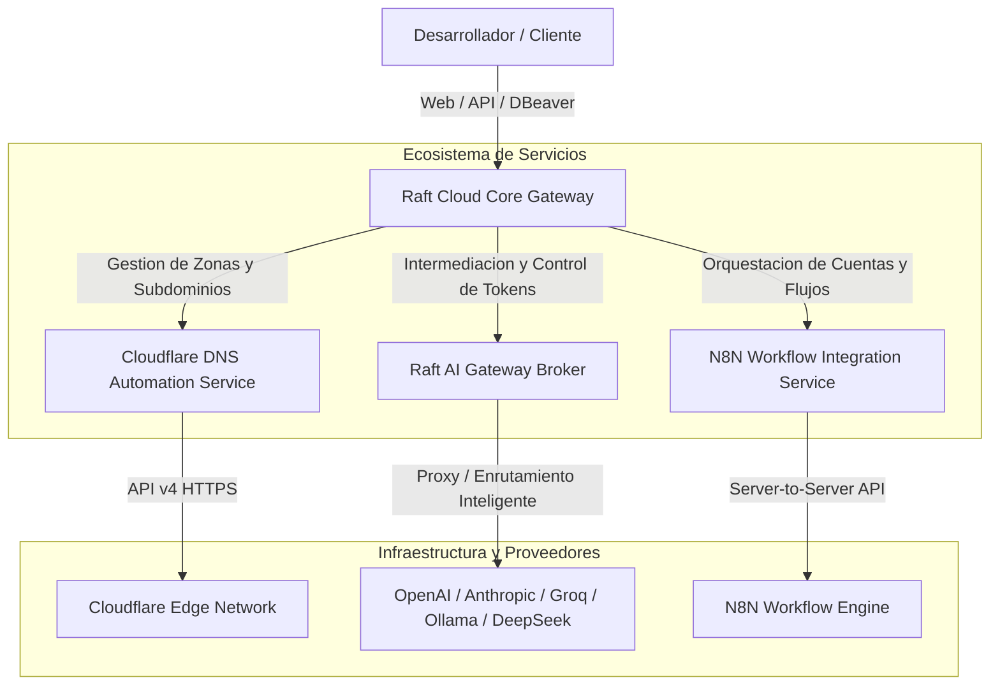
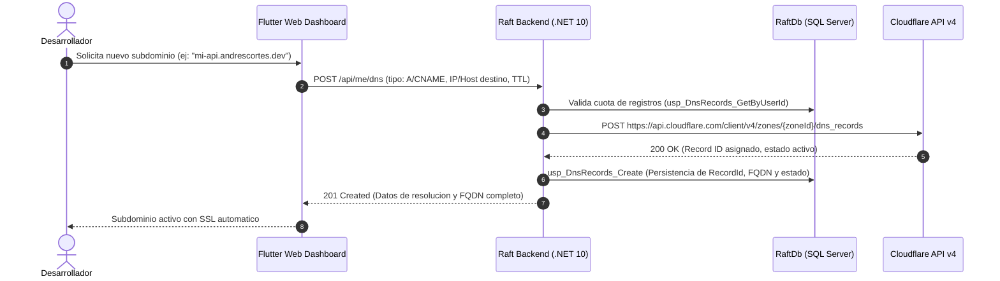
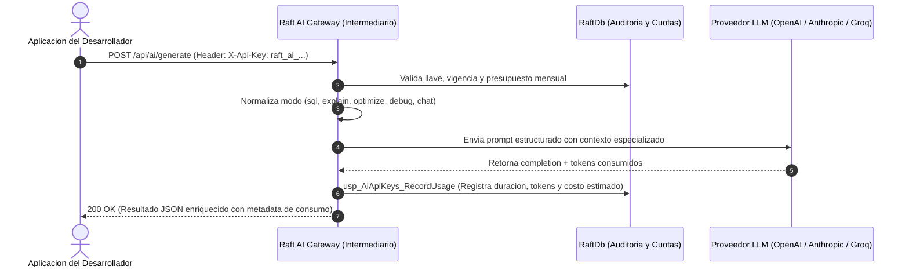
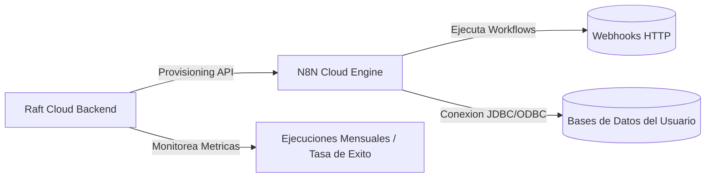

# Servicios del Ecosistema Raft Cloud: DNS, Pasarela de IA, N8N e Infraestructura VPS

## 1. Vision General de los Servicios de Extension

Raft Cloud trasciende el aprovisionamiento de bases de datos para constituirse como una **Plataforma de Desarrollo Integral (Developer Cloud)**. Para que una aplicacion moderna funcione no basta con almacenamiento persistente; requiere:
1. **Identidad y Resolucion de Red:** Automatizacion de dominios y registros DNS.
2. **Capacidades Cognitivas:** Acceso controlado y auditado a Inteligencia Artificial Generativa.
3. **Automatizacion de Procesos:** Orquestacion de flujos de trabajo e integracion mediante webhooks (N8N).
4. **Infraestructura de Alto Rendimiento:** Clusterizacion contenerizada sobre servidores dedicados.

---

## 2. Servicio de Automatizacion DNS (Cloudflare DNS Integration)

### 2.1 Proposito y Flujo de Funcionamiento
El servicio de DNS (`DnsProvisioningService.cs`) permite que los desarrolladores aprovisionen y vinculen nombres de dominio reales y subdominios personalizados de segundo y tercer nivel (bajo la zona raiz `andrescortes.dev`) a sus aplicaciones y bases de datos.

### 2.2 Caracteristicas y Capacidades Tecnicas:
- **Tipos de Registro Soportados:**
  - `A`: Vinculacion de subdominios a direcciones IPv4 publicas de servidores o VPS.
  - `CNAME`: Redireccion canonica a nombres de host externos.
  - `TXT`: Verificaciones de propiedad de dominio y firmas SPF/DKIM.
- **Normalizacion y Seguridad de Labels:** Filtrado contra caracteres invalidos, conversion a minusculas y prevencion de inyecciones de cabeceras en Cloudflare.
- **Proxy Cloudflare y Certificados SSL:** Opcion de activar o desactivar la nube naranja de Cloudflare (`Proxied: true/false`), habilitando proteccion DDoS y emision automatica de certificados SSL/TLS wildcard.
- **Limites y Control:**
  - Maximo de registros configurables por usuario (por defecto: 5 registros activos por cuenta).
  - Estados del registro: `Pending` (en creacion), `Active` (activo en Cloudflare), `Revoked` (eliminado).
  - Al eliminar un registro en el panel de Raft, se elimina de forma sincronica en la zona de Cloudflare (`DELETE /dns_records/{id}`).

---

## 3. Pasarela de Inteligencia Artificial (Raft AI Gateway como Intermediario)

### 3.1 El Rol Crucial de Raft como Broker / Intermediario de IA
Uno de los puntos mas fuertes de la plataforma es su pasarela inteligente de IA (`AiService.cs`). En lugar de obligar a los desarrolladores a ingresar tarjetas de credito en OpenAI o Anthropic, o exponer llaves maestras en aplicaciones frontend, **Raft Cloud actua como un intermediario seguro, auditor y balanceador**.

### 3.2 Capacidades de la Pasarela de IA:
1. **Modos Especializados de Generacion:**
   - `sql`: Genera sentencias T-SQL, PostgreSQL, MongoDB o MySQL validadas segun el contexto del esquema del usuario.
   - `explain`: Explica planes de ejecucion de consultas y desglosa la complejidad algoritmica.
   - `optimize`: Sugiere creacion de indices, reescritura de joins y tecnicas de reduccion de I/O.
   - `debug`: Diagnostica mensajes de error de bases de datos y recomienda soluciones.
   - `chat`: Asistente general de programacion y arquitectura.
2. **Compatibilidad con Estandar OpenAI (`/v1/chat/completions`):**
   - El endpoint `ProxyOpenAiChatCompletionAsync` permite que cualquier cliente o libreria compatible con OpenAI (LangChain, LlamaIndex, SDKs de Python/Node.js) se conecte a Raft simplemente cambiando la `BaseURL` y usando la `raft_ai_...` API Key.
3. **Auditoria y Control de Consumo (Tabla `AiUsageLogs`):**
   - Cada inferencia registra: `UserId`, `ApiKeyId`, `Model`, `Provider`, `PromptTokens`, `CompletionTokens`, `DurationMs`, `ApproxCostUsd` y codigo de estado.
   - Si un desarrollador excede su cuota mensual de tokens asignada, la llave entra en proteccion automatica bloqueando abusos.

---

## 4. Orquestacion de Flujos con N8N (N8N Workflow Integration)

### 4.1 Proposito y Arquitectura de Integracion
N8N es una plataforma de automatizacion de flujos de trabajo basada en nodos (similar a Zapier pero orientada a ingenieria). Raft Cloud integra la gestion de entornos N8N (`N8nProvisioningService.cs`) para habilitar la automatizacion de tareas sobre las bases de datos de los estudiantes (ETLs, respaldos programados, alertas de consumo y webhooks).

### 4.2 Caracteristicas y Metricas Monitoreadas:
- **Aprovisionamiento de Cuentas:** Cada usuario puede activar su cuenta de N8N con credenciales generadas de forma segura.
- **Control de Cuotas de Ejecucion:**
  - Limite mensual de ejecuciones (por defecto: 10,000 ejecuciones/mes).
  - Monitoreo en tiempo real de: `ActiveWorkflowsCount`, `TotalWorkflowsCount`, `TotalExecutions`, `SuccessfulExecutions`, `FailedExecutions`.
  - Fecha de reseteo mensual automatico de cuotas (`MonthlyResetDate`).

---

## 5. Infraestructura, Red y Topologia VPS

### 5.1 Especificaciones de la Infraestructura
Raft Cloud esta desplegado sobre una arquitectura contenerizada y modular alojada en infraestructura de servidor dedicado (Hetzner Cloud VPS):

- **Direccion IP Publica:** `49.13.85.216`
- **Sistema Operativo Base:** Ubuntu Server Linux (Kernel LTS)
- **Motor de Contenedores:** Docker Engine + Docker Compose

### 5.2 Topologia de Puertos y Servicios de Red:

| Puerto | Protocolo | Servicio / Contenedor | Descripcion y Aislamiento |
| :--- | :--- | :--- | :--- |
| **`5000`** | TCP / HTTP | `raft-backend` | API Web Principal en .NET 10. Expone endpoints publicos y privados con JWT, Rate Limiting y documentacion Scalar en `/scalar/v1`. |
| **`1433`** | TCP / TDS | `raft-sqlserver` | Motor Microsoft SQL Server 2022. Aloja la base maestra `RaftDb` y las bases aisladas de estudiantes (`raft_uX_*`). |
| **`5432`** | TCP / PG | Instancia PostgreSQL 16 | Motor PostgreSQL dedicado. Aislado mediante politicas de roles y bloqueo de `template1`. |
| **`27017`** | TCP / Mongo | Instancia MongoDB 7.0 | Motor NoSQL con autenticacion por base de datos activa. |
| **`3306`** | TCP / MySQL | Cluster Celula ABA (`db.aba.andrescortes.dev`) | Instancia externa de MySQL administrada por celula socia con proteccion ProxySQL. |
| **`443`** | TCP / HTTPS | Cloudflare Edge | Enrutamiento de nombres de dominio y terminacion TLS para dominios aprovisionados. |

### 5.3 Seguridad en Red y Politicas de Despliegue:
1. **Red Bridge Aislada en Docker:** Los contenedores internos se comunican a traves de redes virtuales de Docker sin exponer conexiones internas de administracion al exterior.
2. **Rate Limiting Global:** Rate limiter integrado en ASP.NET Core con politica de particion por IP/Token (100 peticiones/minuto) para mitigar ataques de denegacion de servicio (DDoS y brute force).
3. **Persistencia en Volumenes:** Todos los datos de SQL Server, Postgres y Mongo residen en volumenes mapeados al almacenamiento solido del host (SSD NVMe), asegurando que un reinicio de contenedor no ocasione perdida de datos.
