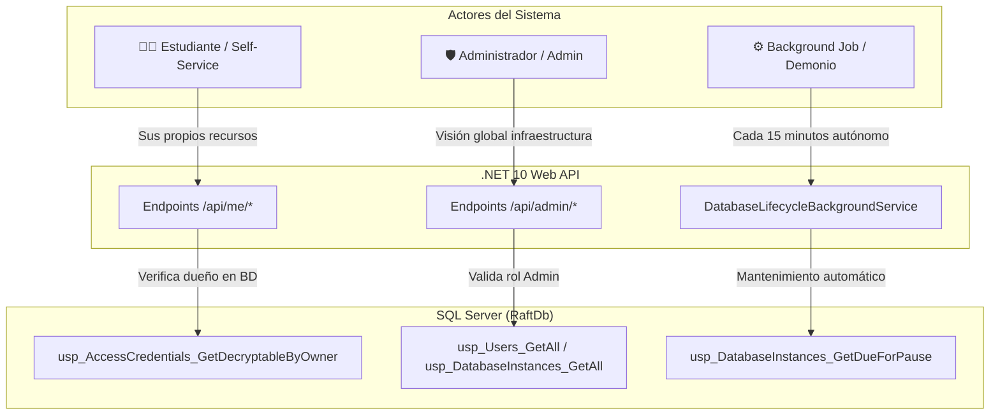

# 📖 Auditoría y Diagnóstico de Stored Procedures: Backend Core (Raft-DB)

> **Fecha de Auditoría:** 2026-08-04  
> **Servidor BD:** `49.13.85.216` (Base de Datos: `RaftDb`)  
> **Backend Framework:** .NET 10 Web API (`raft-backend.csproj`), organizado como monolito modular bajo `Modules/`  
> **Total Procedimientos Analizados:** 44 SPs

---

## 💡 Guía Conceptual: ¿Cómo entender los Roles y Flujos de la Plataforma?

Dado que este backend opera bajo una arquitectura **Database-Centric** (donde la base de datos es quien valida y ejecuta la lógica de negocio), las operaciones invocadas por los Stored Procedures se clasifican en **3 tipos de actores u orígenes**:

### 1. 🟢 **Self-Service / Estudiante (Flujo Core)**
* **¿Quién es?** El usuario final (estudiante o desarrollador) que se registra en la plataforma.
* **¿Qué hace?** Gestiona únicamente **sus propios recursos**. Por ejemplo: crear su base de datos (`POST /api/me/databases`), consultar sus credenciales (`GET /api/me/databases/{id}/credentials`) o ver su dashboard (`GET /api/me/dashboard`).
* **Seguridad en BD:** Stored Procedures como `usp_AccessCredentials_GetDecryptableByOwner` reciben el `UserId` del estudiante y la propia base de datos SQL Server verifica que el recurso le pertenezca antes de devolver información confidencial.

### 2. 🛡️ **Admin (Administrador de Infraestructura)**
* **¿Quién es?** El operador o superusuario de la plataforma de hosting.
* **¿Qué hace?** Operaciones de supervisión global sobre **cualquier usuario o base de datos**. Por ejemplo: ver la lista completa de todos los estudiantes (`GET /api/users`), listar todas las bases de datos del servidor (`GET /api/database-instances`) o auditar eventos globales (`GET /api/audit-events`).
* **Diferencia con Estudiante:** Un estudiante normal **NO puede consumir** los Stored Procedures ni endpoints etiquetados como **Admin**. Si lo intenta, el backend rechaza la petición por falta de permisos.

### 3. ⚙️ **Background Job (Trabajador Automático en Segundo Plano)**
* **¿Quién es?** No es una persona. Es una tarea automática programada en el backend que se ejecuta cada 15 minutos sin intervención humana.
* **¿Qué hace?** Mantenimiento preventivo de la infraestructura: apaga/pausa bases inactivas por más de 7 días (`usp_DatabaseInstances_GetDueForPause`), marca para borrado las inactivas por más de 30 días (`usp_DatabaseInstances_GetDueForDelete`), actualiza el almacenamiento en disco (`usp_DatabaseInstances_UpdateUsedSpace`) y rastrea conexiones activas (`usp_DatabaseInstances_TouchActivityByDatabaseName`).

---

## 📊 Matriz Detallada de Diagnóstico y Auditoría (44 SPs)

### 1. Dominio: Usuarios y Autenticación

| # | Stored Procedure | Servicio C# Invocador | Endpoint HTTP / Origen | Diagnóstico y Estado | Descripción y Lógica Interna (SQL Server) | Información Complementaria y Contexto |
|---|---|---|---|---|---|---|
| 1 | `usp_Users_GetAll` | `UserService.GetAllAsync` | `GET /api/users` | 🟢 **Activo (Admin)** | Recupera el listado completo de usuarios registrados cuyo estado no esté eliminado (`IsDeleted = 0`). | Usado por el administrador para listar estudiantes. Excluye hashes de contraseñas. |
| 2 | `usp_Users_GetById` | `UserService.GetByIdAsync` | `GET /api/users/{id}` | 🟢 **Activo (Admin / Core)** | Busca y retorna la información detallada de un usuario específico por su `UserId`. | Utilizado por controladores para verificar perfiles y validar existencia de usuarios. |
| 3 | `usp_Users_Create` | `UserService.CreateAsync` | `POST /api/users` | 🟢 **Activo (Admin manual)** | Inserta un nuevo usuario manualmente asignando email, rol y estado. | Operación administrativa manual. **No aprovisiona bases de datos automáticamente**. |
| 4 | `usp_Users_Update` | `UserService.UpdateAsync` | `PUT /api/users/{id}` | ⚠️ **Activo (Admin)** | Modifica los datos básicos del perfil de usuario (Nombre, Email, Rol, Estado). | ⚠️ Se debe evitar modificar los campos de OAuth (`Provider` y `ProviderUserId`) para no romper la vinculación federada. |
| 5 | `usp_Users_SoftDelete` | `UserService.SoftDeleteAsync` | `DELETE /api/users/{id}` | 🟢 **Activo (Admin)** | Realiza un borrado lógico estableciendo `IsDeleted = 1` y actualizando timestamp. | Preserva la trazabilidad de auditoría e historial sin destruir físicamente el registro. |
| 6 | `usp_Users_RegisterWithPassword` | `AuthService.RegisterWithPasswordAsync` | `POST /api/auth/register` | 🟢 **Activo (Self-Service)** | Inserta un usuario local recibiendo su correo y el hash BCrypt de la contraseña. | El hash es generado en C# con `BCrypt.Net-Next`. No crea bases de datos automáticamente. |
| 7 | `usp_Users_GetByEmailForLogin` | `AuthService.LoginWithPasswordAsync` | `POST /api/auth/login` | 🟢 **Activo (Self-Service)** | Busca el usuario activo correspondiente a un email para el login por contraseña. | Devuelve el hash almacenado para que el backend verifique la clave y emita el JWT. |
| 8 | `usp_Users_UpsertFromOAuth` | `AuthService.CompleteExternalLoginAsync` | `GET /api/auth/external-callback` | 🟢 **Activo (Self-Service)** | Registra un nuevo usuario de GitHub/Google o actualiza su perfil si ya existía. | Unicidad por `Provider` + `ProviderUserId`. Asigna rol 'Estudiante' por defecto. |

---

### 2. Dominio: Aprovisionamiento de SQL Server e Instancias

| # | Stored Procedure | Servicio C# Invocador | Endpoint HTTP / Origen | Diagnóstico y Estado | Descripción y Lógica Interna (SQL Server) | Información Complementaria y Contexto |
|---|---|---|---|---|---|---|
| 9 | `usp_Users_GetSharedSqlServerProvisioningState` | `SqlServerProvisioningService.ProvisionDatabaseAsync` | `POST /api/me/databases` | 🟢 **Activo (Self-Service Core)** | Evalúa si el usuario ya posee un Login SQL Server compartido o si requiere crear uno nuevo. | **Inteligencia en BD:** Implementa la regla de reuso de credenciales cuando un estudiante crea N bases de datos. |
| 10 | `usp_DatabaseInstances_GetAll` | `DatabaseInstanceService.GetAllAsync` | `GET /api/database-instances` | 🟢 **Activo (Admin)** | Obtiene la lista global de todas las instancias de bases de datos creadas. | Utilizado por la vista administrativa para monitoreo global de almacenamiento e infraestructura. |
| 11 | `usp_DatabaseInstances_GetById` | `DatabaseInstanceService.GetByIdAsync` | `GET /api/database-instances/{id}` | 🟢 **Activo (Admin / Core)** | Retorna el detalle técnico de una instancia consultada mediante su `DatabaseInstanceId`. | Muestra estado operacional (Active, Paused, Deleted), cuotas de espacio y usuario dueño. |
| 12 | `usp_DatabaseInstances_Create` | `SqlServerProvisioningService.ProvisionDatabaseAsync` | `POST /api/me/databases` | 🟢 **Activo (Self-Service Core)** | Registra la nueva instancia en la tabla `DatabaseInstances` con cuotas y estado 'Active'. | Se ejecuta tras la creación física del archivo de base de datos en SQL Server mediante comandos DDL. |
| 13 | `usp_DatabaseInstances_Update` | `DatabaseInstanceService.UpdateAsync` | `PUT /api/database-instances/{id}` | 🟢 **Activo (Admin)** | Modifica parámetros administrativos de una instancia (nombre, cuota máxima, estado). | Permite al administrador ajustar cuotas de almacenamiento manualmente. |
| 14 | `usp_DatabaseInstances_SoftDelete` | `SqlServerProvisioningService.DeleteDatabaseAsync` | `DELETE /api/me/databases/{id}` | 🟢 **Activo (Self-Service / Admin)** | Marca la instancia como eliminada (`IsDeleted = 1`) y registra la fecha de baja. | Se ejecuta en conjunto con la eliminación física del archivo `.mdf` de la base de datos. |
| 15 | `usp_DatabaseInstances_UpdateStatus` | `SqlServerProvisioningService.Pause/Resume` | `PUT /api/me/databases/{id}/pause` y `/resume` | 🟢 **Activo (Self-Service / Admin)** | Cambia el estado operacional de la instancia (ejemplo: 'Active' ↔ 'Paused'). | Invocado por las acciones self-service del estudiante o por el Background Job de inactividad. |
| 16 | `usp_DatabaseInstances_GetSharedLoginCleanupState` | `SqlServerProvisioningService.DeleteDatabaseAsync` | `DELETE /api/me/databases/{id}` | 🟢 **Activo (Self-Service Core)** | Evalúa si al eliminar la BD el usuario se queda sin otras instancias para decidir si borrar el Login SQL Server. | **Inteligencia en BD:** Evita dejar Logins huérfanos en SQL Server cuando el estudiante borra su última BD. |

---

### 3. Dominio: Ciclo de Vida y Background Services

| # | Stored Procedure | Servicio C# Invocador | Endpoint HTTP / Origen | Diagnóstico y Estado | Descripción y Lógica Interna (SQL Server) | Información Complementaria y Contexto |
|---|---|---|---|---|---|---|
| 17 | `usp_DatabaseInstances_GetDueForPause` | `DatabaseLifecycleBackgroundService` | ⚙️ **Background Worker** (cada 15 min) | 🟢 **Activo (Background Job)** | Selecciona instancias 'Active' sin actividad registrada en los últimos 7 días. | Permite pausar automáticamente bases inactivas para liberar RAM/CPU en el servidor. |
| 18 | `usp_DatabaseInstances_GetDueForDelete` | `DatabaseLifecycleBackgroundService` | ⚙️ **Background Worker** (cada 15 min) | 🟢 **Activo (Background Job)** | Identifica instancias pausadas o inactivas por más de 30 días acumulados. | Automatiza la recuperación de disco eliminando recursos abandonados. |
| 19 | `usp_DatabaseInstances_UpdateUsedSpace` | `DatabaseLifecycleBackgroundService` | ⚙️ **Background Worker** (cada 15 min) | 🟢 **Activo (Background Job)** | Actualiza los bytes consumidos en disco por cada BD en la tabla `DatabaseInstances`. | El worker mide el tamaño del archivo `.mdf` en disco y refresca la cuota consumida. |
| 20 | `usp_DatabaseInstances_TouchActivityByDatabaseName` | `DatabaseLifecycleBackgroundService` | ⚙️ **Background Worker** (cada 15 min) | 🟢 **Activo (Background Job)** | Actualiza fecha de última actividad buscando conexiones activas en `sys.dm_exec_sessions` por nombre de BD. | ⚡ **Actualizado (31-Jul-2026):** Soporta el esquema de logins compartidos por estudiante. |
| 21 | `usp_DatabaseInstances_TouchActivityByDatabaseUser` | *Ninguno (Desconectado)* | *Ninguno* | 🟡 **Obsoleto / Legacy** | Registraba actividad filtrando únicamente por el nombre de usuario de la BD. | 🟡 Obsoleto tras la migración del 31-Jul. Se puede depurar eventualmente en la BD. |

---

### 4. Dominio: Gestión de Credenciales y Cifrado

| # | Stored Procedure | Servicio C# Invocador | Endpoint HTTP / Origen | Diagnóstico y Estado | Descripción y Lógica Interna (SQL Server) | Información Complementaria y Contexto |
|---|---|---|---|---|---|---|
| 22 | `usp_AccessCredentials_GetAll` | `AccessCredentialService.GetAllAsync` | `GET /api/access-credentials` | 🟢 **Activo (Admin)** | Listado de credenciales registradas omitiendo las contraseñas en texto plano. | Uso administrativo. Retorna parámetros de conexión manteniendo los secretos ocultos. |
| 23 | `usp_AccessCredentials_GetById` | `AccessCredentialService.GetByIdAsync` | `GET /api/access-credentials/{id}` | 🟢 **Activo (Admin)** | Obtiene los datos de una credencial específica por su `AccessCredentialId`. | Utilizado en validaciones internas de conectividad por el equipo administrador. |
| 24 | `usp_AccessCredentials_GetByDatabaseInstanceId` | `AccessCredentialService.GetByDatabaseInstanceIdAsync` | `GET /api/access-credentials/by-instance/{id}` | 🟢 **Activo (Admin / Core)** | Recupera la credencial vinculada directamente a una instancia de BD (Relación 1:1). | Permite consultar la configuración de acceso asociada a la BD de un estudiante. |
| 25 | `usp_AccessCredentials_Create` | `SqlServerProvisioningService.ProvisionDatabaseAsync` | `POST /api/me/databases` | 🟢 **Activo (Self-Service Core)** | Almacena parámetros de acceso y la contraseña previamente cifrada. | La contraseña se cifra en C# con `DataProtection` antes de invocar este SP. |
| 26 | `usp_AccessCredentials_Update` | `AccessCredentialService.UpdateAsync` | `PUT /api/access-credentials/{id}` | 🟢 **Activo (Admin)** | Actualiza datos de conexión o renueva el secreto cifrado de una credencial. | Permite el restablecimiento de contraseñas de bases de datos asignadas. |
| 27 | `usp_AccessCredentials_SoftDelete` | `SqlServerProvisioningService.DeleteDatabaseAsync` | `DELETE /api/me/databases/{id}` | 🟢 **Activo (Self-Service / Admin)** | Marca la credencial asociada como eliminada (`IsDeleted = 1`). | Invocado automáticamente al eliminar la instancia de base de datos. |
| 28 | `usp_AccessCredentials_GetDecryptableByOwner` | `AccessCredentialService.RevealPasswordAsync` | `GET /api/me/databases/{id}/credentials` | 🟢 **Activo (Self-Service Core)** | Valida en SQL Server que el `UserId` sea el dueño legítimo de la instancia antes de devolver la contraseña cifrada. | 🔒 **Control de Seguridad Core:** SQL Server verifica la propiedad. Si cumple, C# descifra el secreto y lo entrega en texto plano. |

---

### 5. Dominio: Auditoría de Eventos

| # | Stored Procedure | Servicio C# Invocador | Endpoint HTTP / Origen | Diagnóstico y Estado | Descripción y Lógica Interna (SQL Server) | Información Complementaria y Contexto |
|---|---|---|---|---|---|---|
| 29 | `usp_AuditEvents_GetAll` | `AuditEventService.GetAllAsync` | `GET /api/audit-events` | 🟢 **Activo (Admin)** | Retorna la bitácora completa de eventos de auditoría registrados. | Permite revisar el historial global de operaciones del sistema. |
| 30 | `usp_AuditEvents_GetById` | `AuditEventService.GetByIdAsync` | `GET /api/audit-events/{id}` | 🟢 **Activo (Admin)** | Recupera la información detallada de un evento de auditoría específico por `AuditEventId`. | Incluye metadata (IP de origen, ID del usuario ejecutor, payload JSON y timestamp). |
| 31 | `usp_AuditEvents_Create` | `AuditEventService.CreateAsync` | Interno (Provisioning y Self-Service) | 🟢 **Activo (Core System)** | Inserta un nuevo registro de evento de auditoría en la tabla `AuditEvents`. | Invocado tras acciones sensibles como `DATABASE_PROVISIONED`, `USER_REGISTERED` o `PASSWORD_REVEALED`. |
| 32 | `usp_AuditEvents_Update` | `AuditEventService.UpdateAsync` | `PUT /api/audit-events/{id}` | 🟢 **Activo (Admin)** | Permite actualizar anotaciones o metadatos de un registro de auditoría. | Operación administrativa secundaria para enriquecimiento de bitácoras. |
| 33 | `usp_AuditEvents_SoftDelete` | `AuditEventService.SoftDeleteAsync` | `DELETE /api/audit-events/{id}` | 🟢 **Activo (Admin)** | Aplica borrado lógico (`IsDeleted = 1`) a un registro de auditoría. | Preserva la información en la BD sin destruir la evidencia histórica. |

---

### 6. Dominio: Métricas y Dashboards

| # | Stored Procedure | Servicio C# Invocador | Endpoint HTTP / Origen | Diagnóstico y Estado | Descripción y Lógica Interna (SQL Server) | Información Complementaria y Contexto |
|---|---|---|---|---|---|---|
| 34 | `usp_PlatformMetrics_Get` | `PlatformMetricsService.GetAsync` | `GET /api/metrics` | 🟢 **Activo (Público)** | Calcula métricas agregadas globales (Total Usuarios, BDs Activas, Espacio Usado). | **Endpoint Público:** Alimenta los contadores expuestos en la landing page del proyecto. |
| 35 | `usp_UserDashboard_GetByUserId` | `UserDashboardService.GetByUserIdAsync` | `GET /api/me/dashboard` | 🟢 **Activo (Self-Service Core)** | Compila el resumen de recursos del estudiante (bases creadas, espacio consumido, límites restantes y sus BDs). | Consumido por el panel principal del usuario estudiante al iniciar sesión. |

---

## 📌 Resumen Ejecutivo para la Toma de Decisiones

1. **No requiere conocimientos en C# para operarlo:** La lógica de negocio está completamente contenida en los 44 Stored Procedures de SQL Server. Modificar reglas de cuotas, límites de bases por usuario, DNS o tiempos de inactividad se realiza editando directamente los Stored Procedures o los registros de configuración en SQL Server.
2. **Seguridad Multi-inquilino (Multi-tenant):** Toda consulta Self-Service del estudiante (`/api/me/*`) depende de procedimientos como `usp_AccessCredentials_GetDecryptableByOwner` que obligan a verificar en la cláusula `WHERE` que `UserId` coincida con el dueño de la instancia.
3. **Flujos Administrativos aislados:** Las rutas etiquetadas como `Admin` (`GET /api/users`, `GET /api/database-instances`, etc.) están protegidas en el backend por filtros de autorización JWT que exigen el rol `Admin`.

---

### 7. Dominio: DNS y Subdominios

| # | Stored Procedure | Servicio C# Invocador | Endpoint HTTP / Origen | Diagnóstico y Estado | Descripción y Lógica Interna (SQL Server) | Información Complementaria y Contexto |
|---|---|---|---|---|---|---|
| 36 | `usp_DnsRecords_GetAllByUserId` | `DnsProvisioningService.GetAllByUserIdAsync` | `GET /api/me/dns` | 🟢 **Activo (Self-Service)** | Lista los registros DNS del usuario autenticado. | Fuente de verdad local para el historial de subdominios creados por el usuario. |
| 37 | `usp_DnsRecords_GetAll` | `DnsProvisioningService.GetAllAsync` | `GET /api/dns/records` | 🟢 **Activo (Admin)** | Lista todos los registros DNS aprovisionados en la plataforma. | Permite al administrador auditar el inventario global de subdominios. |
| 38 | `usp_DnsRecords_GetById` | `DnsProvisioningService.GetByIdAsync` | `GET /api/dns/records/{id}` | 🟢 **Activo (Admin / Core)** | Recupera un registro DNS por su identificador interno. | Retorna label, FQDN, content, estado y metadatos de sincronización. |
| 39 | `usp_DnsRecords_GetByIdAndUserId` | `DnsProvisioningService.GetByIdForUserAsync` | `GET /api/me/dns/{id}` | 🟢 **Activo (Self-Service)** | Recupera un registro DNS solo si pertenece al usuario autenticado. | Evita exposición cruzada entre usuarios. |
| 40 | `usp_DnsRecords_GetActiveByUserIdAndFqdn` | `DnsProvisioningService.ProvisionAsync` | `POST /api/me/dns/provision` | 🟢 **Activo (Self-Service Core)** | Detecta si el usuario ya tiene un subdominio activo o pendiente con el mismo FQDN. | Evita duplicar subdominios y respeta la cuota por usuario. |
| 41 | `usp_DnsRecords_Create` | `DnsProvisioningService.ProvisionAsync` | `POST /api/me/dns/provision` | 🟢 **Activo (Self-Service Core)** | Inserta el registro local en estado `Pending` antes de llamar a Cloudflare. | La BD es la fuente de trazabilidad aunque la creación real se haga en Cloudflare. |
| 42 | `usp_DnsRecords_MarkProvisioned` | `DnsProvisioningService.ProvisionAsync` | `POST /api/me/dns/provision` | 🟢 **Activo (Self-Service Core)** | Marca el registro como `Active` después de recibir el `dns_record_id` de Cloudflare. | Guarda el id remoto para poder revocar el registro posteriormente. |
| 43 | `usp_DnsRecords_MarkFailed` | `DnsProvisioningService.ProvisionAsync` | `POST /api/me/dns/provision` | 🟢 **Activo (Self-Service Core)** | Marca la provisión como `Failed` y almacena el error. | Útil cuando Cloudflare responde con error o la sincronización local falla. |
| 44 | `usp_DnsRecords_Revoke` | `DnsProvisioningService.RevokeAsync` | `DELETE /api/me/dns/{id}` y `POST /api/dns/records/{id}/revoke` | 🟢 **Activo (Self-Service / Admin)** | Marca el registro DNS como `Revoked` y conserva el historial local. | El backend también elimina el record remoto en Cloudflare si existe `CloudflareRecordId`. |
